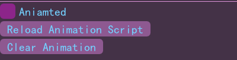

# ParticleTest

OpenGL Demo.

## vendor

GLFW:https://www.glfw.org/

assimp:https://github.com/assimp/assimp

ImGui:https://github.com/ocornut/imgui

ImGuiFileDialog:https://github.com/aiekick/ImGuiFileDialog

stb:https://github.com/nothings/stb

glm:https://github.com/g-truc/glm

premake:https://premake.github.io/

# Profile

## 摄像机操作

**按下左键滑动**，旋转摄像头。

焦点在场景窗口上，使用**W,A,S,D,Space,left_shift,**控制摄像机移动。与Minecraft的creative mode的移动逻辑相同。

## 动态添加物体

通过菜单栏Scene -> Add Scene Object -> Add Object, 弹出Add Object对话框。

勾选Animatable单选框，创建支持动画的物体。

Object Name文本框输入物体名称。物体名称必须唯一。

Object Type选择预置的形状，也可以选择None，创建空物体。

点击OK创建物体并关闭对话框。

点击Cancel放弃创建物体，并关闭对话框。

## 物体的位姿

对于选中的物体可以通过控件控制它的变换。包括：位置、欧拉角、缩放、斜切、是否可见。

## 物体树形关系结构

场景中所有物体之间具有亲子关系，组成树形结构。

子物体的变换继承父物体的变换。

拖动节点可以改变父子关系。

被选中物体上会绘制坐标轴。

双击节点，使摄像头对准目标物体。

## 纹理

### 动态加载图片作为纹理资源

菜单栏 -> Scene -> Load Texture 弹出Texture Load对话框。对话框加载图片并预览。通过对话框设置纹理属性，例如纹理名称、采样方式，纹理类型，wrap类型，是否反转y轴。

纹理类型包括：漫反射纹理、镜面反射纹理、法线贴图、高度贴图。

点击Load加载图片到纹理并关闭对话框。

### 使用纹理

在Sprite Propterty可以编辑物体的材质。此处可使用已经加载的纹理。

#### 漫反射纹理

#### 镜面反射纹理

#### 法线贴图

## 动态光源

光源可以跟物体一样动态添加。有三种光源可选：平行光、点光源、聚光灯。

## 天空盒

支持天空盒动态添加和动态修改。

## 动画

通过脚本记录关键帧，进行插帧动画。

如图是一个沿描点绕y轴旋转的脚本。每秒旋转360度。

脚本第一行为一个整数，指定关键帧的数量。

之后每一行对应一个关键帧。第一个浮点数标志当前关键帧的读秒。接下来三个浮点数标志当前关键帧的位置。再下来三个浮点数标志当前关键帧的缩放倍数。再下来三个浮点数标志当前关键帧的欧拉角。

旋转转换为**四元数**后进行插值，没有万向结死锁的问题。

创建Animatable物体后，该物体可以加载脚本。

## 加载模型

支持模型加载。

菜单栏 -> Scene -> Load Model 弹出文件选择对话框。

## 与顺序无关的半透明

支持“与顺序无关的半透明(Order Independent Transparency)”，即使半透明物体重合也能够正常渲染。

勾选Sprite Property的Transparency即可开启oit.

## 烟花粒子

利用OpenGL的TransformFeedback实现粒子效果。

Object Type为Firework和Hanabi分别为两种烟花粒子。

